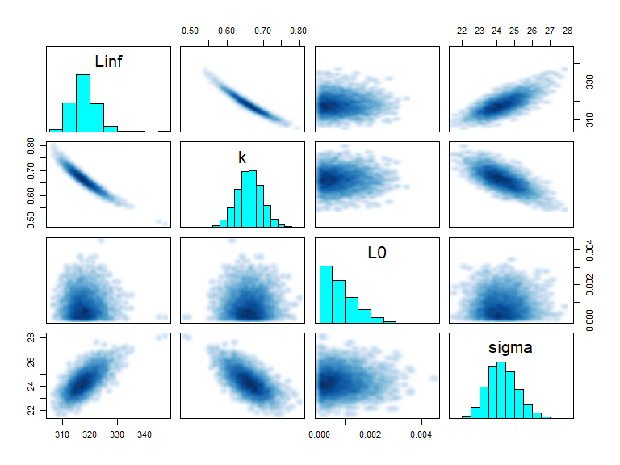
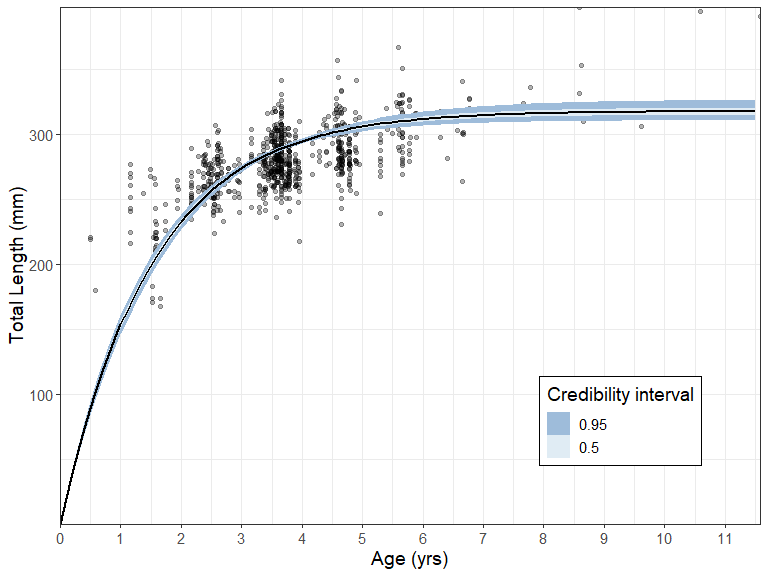
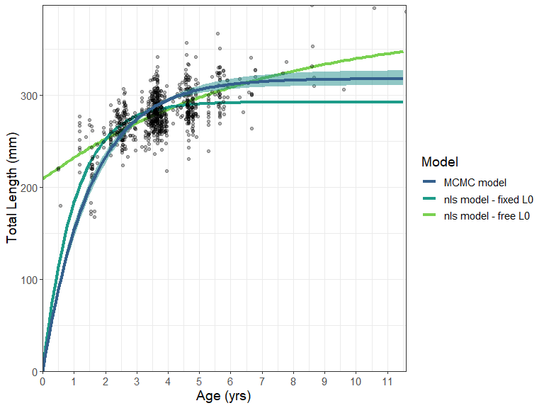

<!-- README.md is generated from README.Rmd. Please edit that file -->

# BayesGrowth

<!-- badges: start -->

[](https://travis-ci.org/jonathansmart/BayesGrowth)
[](https://zenodo.org/badge/latestdoi/223878432)
<!-- badges: end -->

BayesGrowth combines length-at-age modelling for fisheries with MCMC
implemented using JAGS and the
[rjags](https://cran.r-project.org/web/packages/rjags/index.html)
package. Growth modelling using models such as the von Bertalanffy
growth model involves three parameters:
,
*k* and either

or
.
Two of these parameters:

and

have direct biological meaning as the size-at-birth and maximum length,
respectively. This package provides the tools to run an MCMC model with
these two parameters treated as size-at-birth and maximum length using a
JAGS model. This MCMC model is pre-specified and built into wrapper
functions.

The user can therefore run an MCMC growth model using knowledge of
species length-at-birth and maximum size as priors.

## Installation

This package provides a series of wrapper functions to the rjags package
which will run JAGS (“Just Another Gibbs Sampler”) MCMC models.
Therefore, **JAGS must be installed before this package is installed**.
To install JAGS, visit:
<https://sourceforge.net/projects/mcmc-jags/files/>

You can install the released version of BayesGrowth from
[Github](https://github.com/jonathansmart/BayesGrowth) with:

``` r
devtools::install_github("jonathansmart/BayesGrowth")
```

## Usage

The main `BayesGrowth` function is `Estimate_MCMC_Growth` which is the
wrapper function around an rjags model. It requires a data input that
includes columns that can be identified “Age” and “Length”, the model
needs to be specified (several options are available) and the priors
must be specified. Priors include the max size with an error,
length-at-birth with an error and upper limits for *k* and
.
These latter two parameters have no informative priors and only require
sensible upper bounds. Many fish species (including this example) have a
size at birth of zero. Therefore, this can value can be used as a prior
along with a very small error to indicate high certainty of this prior.
The `L0.se` argument cannot be zero, but the model is specified to
truncate

at zero and keep growth positive.

``` r
library(BayesGrowth)

data("example_data")
## Biological info - lengths in mm
max_size <- 440
max_size_se <- 5
birth_size <- 0
birth_size_se <- 0.001 # an se cannot be zero

# Use the function to estimate the JAGS model
results <- Estimate_MCMC_Growth(example_data, Model = "VB" ,
                     iter = 10000,
                     Linf = max_size,
                     Linf.se = max_size_se,
                     L0 = birth_size,
                     sigma.max = 100,
                     L0.se = birth_size_se,
                     k.max = 1)
```

The function returns the rjags outputs which is an object of class
‘mcmc.list’

``` r
head(results)
#> [[1]]
#> Markov Chain Monte Carlo (MCMC) output:
#> Start = 1001 
#> End = 1007 
#> Thinning interval = 1 
#>                L0     Linf         k    sigma
#> [1,] 1.620193e-03 322.9924 0.6252832 25.33929
#> [2,] 1.888714e-04 321.7057 0.6262001 24.26403
#> [3,] 7.001445e-05 321.4209 0.6346040 24.59340
#> [4,] 1.106807e-03 320.3221 0.6425210 25.17661
#> [5,] 8.420172e-05 318.3766 0.6585767 25.30314
#> [6,] 9.839419e-04 319.5081 0.6521222 24.66876
#> [7,] 2.761105e-04 318.8243 0.6551852 24.31665
#> 
#> [[2]]
#> Markov Chain Monte Carlo (MCMC) output:
#> Start = 1001 
#> End = 1007 
#> Thinning interval = 1 
#>                L0     Linf         k    sigma
#> [1,] 2.729452e-03 315.7365 0.6808001 23.00637
#> [2,] 3.149000e-04 316.2117 0.6726950 23.61696
#> [3,] 4.580170e-04 316.7876 0.6687817 23.75443
#> [4,] 2.669531e-03 316.0115 0.6850629 23.51763
#> [5,] 1.754852e-03 314.7021 0.6785013 23.52310
#> [6,] 1.239856e-04 315.6326 0.6844819 23.45735
#> [7,] 2.318665e-05 314.9931 0.6861442 24.10765
#> 
#> [[3]]
#> Markov Chain Monte Carlo (MCMC) output:
#> Start = 1001 
#> End = 1007 
#> Thinning interval = 1 
#>                L0     Linf         k    sigma
#> [1,] 0.0009088723 320.3561 0.6347524 24.00090
#> [2,] 0.0010109374 320.1480 0.6431379 24.12359
#> [3,] 0.0001968916 321.3025 0.6417628 25.15158
#> [4,] 0.0008266579 320.0616 0.6445093 25.39160
#> [5,] 0.0020838618 320.1917 0.6296088 25.93056
#> [6,] 0.0005640227 322.2117 0.6278904 24.91463
#> [7,] 0.0009385744 321.0957 0.6307897 24.98684
#> 
#> [[4]]
#> Markov Chain Monte Carlo (MCMC) output:
#> Start = 1001 
#> End = 1007 
#> Thinning interval = 1 
#>                L0     Linf         k    sigma
#> [1,] 2.162523e-04 317.0216 0.6627174 23.21808
#> [2,] 1.524742e-03 315.9498 0.6681138 23.32697
#> [3,] 9.151084e-04 317.9562 0.6628014 23.27665
#> [4,] 3.186078e-05 317.6608 0.6610399 23.10562
#> [5,] 1.780628e-03 318.1236 0.6738835 23.36739
#> [6,] 8.652171e-04 316.6314 0.6608945 24.79195
#> [7,] 1.424658e-03 317.8562 0.6597827 24.35975
#> 
#> attr(,"class")
#> [1] "mcmc.list"
```

Therefore, all of the diagnostics from the rjags library can be used.

``` r
summary(results)
#> 
#> Iterations = 1001:11000
#> Thinning interval = 1 
#> Number of chains = 4 
#> Sample size per chain = 10000 
#> 
#> 1. Empirical mean and standard deviation for each variable,
#>    plus standard error of the mean:
#> 
#>            Mean        SD  Naive SE Time-series SE
#> L0    7.983e-04 0.0006055 3.027e-06      2.998e-06
#> Linf  3.182e+02 4.1954397 2.098e-02      1.432e-01
#> k     6.589e-01 0.0350873 1.754e-04      1.191e-03
#> sigma 2.435e+01 0.8847075 4.424e-03      2.245e-02
#> 
#> 2. Quantiles for each variable:
#> 
#>            2.5%       25%       50%       75%     97.5%
#> L0    3.062e-05 3.193e-04 6.697e-04 1.152e-03 2.256e-03
#> Linf  3.107e+02 3.153e+02 3.179e+02 3.208e+02 3.272e+02
#> k     5.899e-01 6.353e-01 6.591e-01 6.823e-01 7.283e-01
#> sigma 2.274e+01 2.373e+01 2.432e+01 2.492e+01 2.618e+01
plot(results,density = T, smooth = F)
```



Additional `BayesGrowth` functions are available that help the user
manipulate the returned `Estimate_MCMC_Growth` object. The
`Calculate_MCMC_growth_curve` function will provide confidence intervals
around the growth curve based on MCMC parameter percentiles. This is
essentially a wrapper around the `tidybayes::mean_qi()` function which
means it can be passed straight into a ggplot with the
`tidybayes::geom_line_ribbon` function.

``` r

# Return a growth curve with 50th and 95th percentiles
growth_curve <- Calculate_MCMC_growth_curve(results, Model = "VB",
                                            max.age = max(example_data$Age), probs = c(.5,.95))
library(tidybayes)
library(ggplot2)

ggplot(growth_curve, aes(Age, LAA))+
  geom_point(data = example_data, aes(Age, Length), alpha = .3)+
  geom_lineribbon( size = .8) +
  labs(y = "Total Length (mm)", x = "Age (yrs)")+
  scale_fill_brewer(palette="BuPu", direction=-1)+
  scale_y_continuous(expand = c(0,0))+
  scale_x_continuous(expand = c(0,0), breaks = seq(0,13,1))+
  theme_bw()+
  theme(text = element_text(size = 14))
```



This represents a much improved fit over a standard non-linear estimated
model, even if the length-at-birth were fixed at zero. Here the fit is
compared using an nls model fit using the [AquaticLifeHistory
package](https://github.com/jonathansmart/AquaticLifeHistory).


