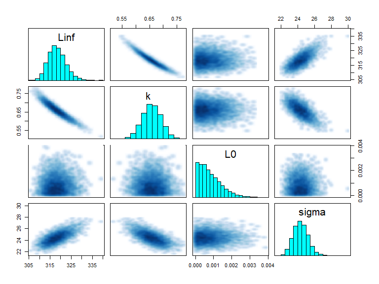

<!-- README.md is generated from README.Rmd. Please edit that file -->

# BayesGrowth

<!-- badges: start -->

[](https://travis-ci.org/jonathansmart/BayesGrowth)
<!-- badges: end -->

BayesGrowth combines length-at-age modelling for fisheries with MCMC
implemented using JAGS and the
[rjags](https://cran.r-project.org/web/packages/rjags/index.html)
package. Growth modelling using models such as the von Bertalanffy
growth model involves three parameters: \(L_{\infty}\), \(k\) and either
\(L_{0}\) or \(t_{0}\). Two of these parameters: \(L_{0}\) and
\(L_{\infty}\) have direct biological meaning as the size-at-birth and
maximum length, respectively. This package provides the tools to run an
MCMC model with these two parameters treated as size-at-birth and
maximum length using a JAGS model. This MCMC model is pre-specified and
built into wrapper functions.

The user can therefore run an MCMC growth model using knowledge of
species length-at-birth and maximum size as priors.

## Installation

This package provides a series of wrapper functions to the rjags package
which will run JAGS (“Just Another Gibbs Sampler”) MCMC models.
Therefore, **JAGS must be installed before this package is installed**.
To install JAGS, visit:
<https://sourceforge.net/projects/mcmc-jags/files/>

You can install the released version of BayesGrowth from
[Github](https://github.com/jonathansmart/BayesGrowth) with:

``` r
devtools::install_github("jonathansmart/BayesGrowth")
```

## Usage

The main `BayesGrowth` function is `Estimate_MCMC_Growth` which is the
wrapper function around an rjags model. It requires a data input that
includes columns that can be identified “Age” and “Length”, the model
needs to be specified (several options are available) and the priors
must be specified. Priors include the max size with an error,
length-at-birth with an error and upper limits for \(k\) and \(\sigma\).
These latter two parameters have no informative priors and only require
sensible upper bounds. Many fish species (including this example) have a
size at birth of zero. Therefore, this can value can be used as a prior
along with a very small error to indicate high certainty of this prior.
The `L0.se` argument cannot be zero, but the model is specified to
truncate \(L_{0}\) at zero and keep growth positive.

``` r
library(BayesGrowth)

data("example_data")
## Biological info - lengths in mm
max_size <- 440
max_size_se <- 5
birth_size <- 0
birth_size_se <- 0.001 # an se cannot be zero

# Use the function to estimate the JAGS model
results <- Estimate_MCMC_Growth(example_data, Model = "VB" ,
                     iter = 10000,
                     Linf = max_size,
                     Linf.se = max_size_se,
                     L0 = birth_size,
                     sigma.max = 100,
                     L0.se = birth_size_se,
                     k.max = 1)
```

The function returns the rjags outputs which is an object of class
‘mcmc.list’

``` r
head(results)
#> [[1]]
#> Markov Chain Monte Carlo (MCMC) output:
#> Start = 1001 
#> End = 1007 
#> Thinning interval = 1 
#>                L0     Linf         k    sigma
#> [1,] 1.483223e-04 317.9185 0.6584323 23.09712
#> [2,] 1.088073e-04 314.9857 0.7077662 23.94156
#> [3,] 6.927317e-04 312.7845 0.6974341 24.31017
#> [4,] 1.094180e-03 313.6392 0.6831496 23.85641
#> [5,] 2.335037e-04 313.6508 0.6846770 23.45256
#> [6,] 3.932446e-05 315.5822 0.6830659 23.71317
#> [7,] 1.172375e-03 315.3345 0.6751340 23.89506
#> 
#> [[2]]
#> Markov Chain Monte Carlo (MCMC) output:
#> Start = 1001 
#> End = 1007 
#> Thinning interval = 1 
#>                L0     Linf         k    sigma
#> [1,] 6.244722e-06 321.6067 0.6252368 24.62203
#> [2,] 2.099683e-04 321.0802 0.6310686 25.22636
#> [3,] 8.470106e-04 320.1362 0.6363388 24.55732
#> [4,] 1.172123e-03 319.3396 0.6474557 24.62156
#> [5,] 2.530439e-04 319.2197 0.6509728 24.56522
#> [6,] 8.747307e-04 319.4180 0.6429824 24.36231
#> [7,] 8.581534e-04 320.1235 0.6472748 24.40982
#> 
#> [[3]]
#> Markov Chain Monte Carlo (MCMC) output:
#> Start = 1001 
#> End = 1007 
#> Thinning interval = 1 
#>                L0     Linf         k    sigma
#> [1,] 0.0009256165 316.2487 0.6827975 24.43492
#> [2,] 0.0010140519 315.3772 0.6783669 24.11184
#> [3,] 0.0008368855 317.7474 0.6500937 24.24865
#> [4,] 0.0002750489 320.1016 0.6347589 25.09238
#> [5,] 0.0007506519 320.7512 0.6389933 25.46154
#> [6,] 0.0008077506 320.9486 0.6390802 25.15107
#> [7,] 0.0002158804 320.5103 0.6344164 25.07480
#> 
#> [[4]]
#> Markov Chain Monte Carlo (MCMC) output:
#> Start = 1001 
#> End = 1007 
#> Thinning interval = 1 
#>                L0     Linf         k    sigma
#> [1,] 0.0006687971 320.6138 0.6449687 25.43026
#> [2,] 0.0017699870 319.3084 0.6429564 23.57450
#> [3,] 0.0003399080 318.0155 0.6445651 24.27122
#> [4,] 0.0001095932 319.8841 0.6245990 24.35767
#> [5,] 0.0015312030 320.4358 0.6315083 25.62919
#> [6,] 0.0001178656 320.5521 0.6444621 23.69427
#> [7,] 0.0022664313 318.0471 0.6451985 23.46126
#> 
#> attr(,"class")
#> [1] "mcmc.list"
```

Therefore, all of the diagnostics from the rjags library can be used.

``` r
summary(results)
#> 
#> Iterations = 1001:11000
#> Thinning interval = 1 
#> Number of chains = 4 
#> Sample size per chain = 10000 
#> 
#> 1. Empirical mean and standard deviation for each variable,
#>    plus standard error of the mean:
#> 
#>            Mean       SD  Naive SE Time-series SE
#> L0    7.962e-04 0.000604 3.020e-06      3.006e-06
#> Linf  3.183e+02 4.255942 2.128e-02      1.466e-01
#> k     6.579e-01 0.035325 1.766e-04      1.208e-03
#> sigma 2.436e+01 0.891578 4.458e-03      2.287e-02
#> 
#> 2. Quantiles for each variable:
#> 
#>            2.5%       25%       50%       75%     97.5%
#> L0    3.154e-05 3.161e-04 6.690e-04 1.149e-03 2.254e-03
#> Linf  3.109e+02 3.154e+02 3.180e+02 3.210e+02 3.277e+02
#> k     5.873e-01 6.344e-01 6.583e-01 6.816e-01 7.268e-01
#> sigma 2.273e+01 2.374e+01 2.432e+01 2.494e+01 2.624e+01
plot(results,density = T, smooth = F)
```



Additional `BayesGrowth` functions are available that help the user
manipulate the returned `Estimate_MCMC_Growth` object. The
`Calculate_MCMC_growth_curve` function will provide confidence intervals
around the growth curve based on MCMC parameter percentiles. This is
essentially a wrapper around the `tidybayes::mean_qi()` function which
means it can be passed straight into a ggplot with the
`tidybayes::geom_line_ribbon` function.

``` r

# Return a growth curve with 50th and 95th percentiles
growth_curve <- Calculate_MCMC_growth_curve(results, Model = "VB",
                                            max.age = max(example_data$Age), probs = c(.5,.95))
library(tidybayes)
library(ggplot2)

ggplot(growth_curve, aes(Age, LAA))+
  geom_point(data = example_data, aes(Age, Length), alpha = .3)+
  geom_lineribbon( size = .8) +
  labs(y = "Total Length (mm)", x = "Age (yrs)")+
  scale_fill_brewer(palette="BuPu", direction=-1)+
  scale_y_continuous(expand = c(0,0))+
  scale_x_continuous(expand = c(0,0), breaks = seq(0,13,1))+
  theme_bw()+
  theme(text = element_text(size = 14))
```


This represents a much improved fit over a standard non-linear estimated
model, even if the length-at-birth were fixed at zero. Here the fit is
compared using an nls model fit using the [AquaticLifeHistory
package](https://github.com/jonathansmart/AquaticLifeHistory).


