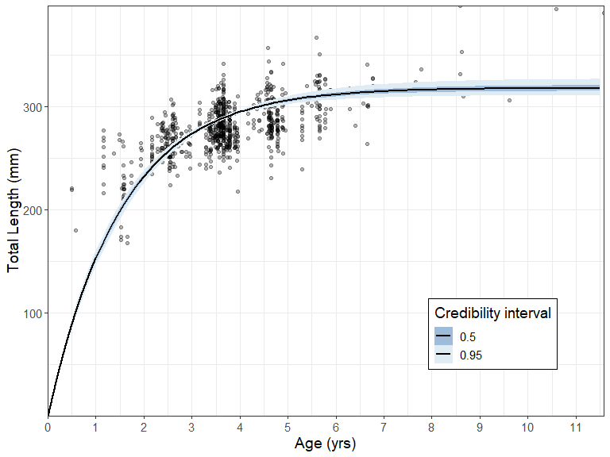

<!-- README.md is generated from README.Rmd. Please edit that file -->
BayesGrowth
===========

<!-- badges: start -->
[](https://travis-ci.org/jonathansmart/BayesGrowth) <!-- badges: end -->

BayesGrowth combines length-at-age modelling for fisheries with MCMC implemented using JAGS and the [rjags](https://cran.r-project.org/web/packages/rjags/index.html) package. Growth modelling using models such as the von Bertalanffy growth model involves three parameters: *L*<sub>∞</sub>, *k* and either *L*<sub>0</sub> or *t*<sub>0</sub>. Two of these parameters: *L*<sub>0</sub> and *L*<sub>∞</sub> have direct biological meaning as the size-at-birth and maximum length, respectively. This package provides the tools to run an MCMC model with these two parameters treated as size-at-birth and maximum length using a JAGS model. This MCMC model is pre-specified and built into wrapper functions.

The user can therefore run an MCMC growth model using knowledge of species length-at-birth and maximum size ast priors.

Installation
------------

You can install the released version of BayesGrowth from [Github](https://github.com/jonathansmart/BayesGrowth) with:

``` r
devtools::install_github("jonathansmart/BayesGrowth")
```

Usage
-----

The main `BayesGrowth` function is `Estimate_MCMC_Growth` which is the wrapper function around an rjags model. It requires a data input that includes Age and Length, a model needs to be specified (several options are available) and the priors must be specified. Priors include the max size with an error, length-at-birth with an error, an upper value for *k* and *σ*. These latter two parameters have no informative priors so just need senscible upper bounds. Many fish species (including this example) have a size at birth of zero. Therefore, this can be used along with a very small error to indicate that this is a certain value. The `L0.se` argument cannot be zero, although the model is specified to truncate it to zero and keep growth positive.

``` r
library(BayesGrowth)

data("example_data")
## Biological info - lengths in mm
max_size <- 440
max_size_se <- 4.4
birth_size <- 0
birth_size_se <- 0.001 # an se cannot be zero

# Use the function to estimate the JAGS model
results <- Estimate_MCMC_Growth(example_data, Model = "VB" ,
                     iter = 10000,
                     Linf = 440,
                     Linf.se = 4.4,
                     L0 = 0,
                     sigma.max = 100,
                     L0.se = .001,
                     k.max = 1)
```

The function returns the rjags outputs which is an object of class 'mcmc.list'

``` r
head(results)
#> [[1]]
#> Markov Chain Monte Carlo (MCMC) output:
#> Start = 1001 
#> End = 1007 
#> Thinning interval = 1 
#>                L0     Linf         k    sigma
#> [1,] 0.0011362422 387.4152 0.3771745 32.44822
#> [2,] 0.0012851324 389.6609 0.3810249 33.54602
#> [3,] 0.0012766798 388.7905 0.3786024 32.93662
#> [4,] 0.0022177229 387.0827 0.3826207 32.91881
#> [5,] 0.0015071031 388.8557 0.3772496 33.49930
#> [6,] 0.0009526393 391.2597 0.3777370 34.41613
#> [7,] 0.0012553141 389.1270 0.3811567 32.72085
#> 
#> [[2]]
#> Markov Chain Monte Carlo (MCMC) output:
#> Start = 1001 
#> End = 1007 
#> Thinning interval = 1 
#>                L0     Linf         k    sigma
#> [1,] 2.986966e-04 389.8056 0.3783192 34.45930
#> [2,] 1.108920e-03 389.9971 0.3773260 32.86083
#> [3,] 1.149033e-03 389.0830 0.3743957 34.59777
#> [4,] 8.846419e-05 389.4341 0.3771916 35.02175
#> [5,] 1.459741e-03 390.0453 0.3765467 34.02243
#> [6,] 1.198310e-04 392.7283 0.3764674 32.81283
#> [7,] 1.247474e-03 390.0569 0.3750319 34.01624
#> 
#> [[3]]
#> Markov Chain Monte Carlo (MCMC) output:
#> Start = 1001 
#> End = 1007 
#> Thinning interval = 1 
#>                L0     Linf         k    sigma
#> [1,] 7.018600e-04 388.4735 0.3803604 34.02299
#> [2,] 7.328129e-04 388.4767 0.3838719 33.72152
#> [3,] 3.872719e-05 389.2014 0.3836277 34.93259
#> [4,] 1.597879e-03 387.6074 0.3748780 33.26182
#> [5,] 7.664179e-04 391.8217 0.3690863 33.78315
#> [6,] 1.067234e-03 392.8400 0.3649841 33.69626
#> [7,] 1.468738e-03 394.7917 0.3664152 35.11650
#> 
#> [[4]]
#> Markov Chain Monte Carlo (MCMC) output:
#> Start = 1001 
#> End = 1007 
#> Thinning interval = 1 
#>                L0     Linf         k    sigma
#> [1,] 1.142753e-04 388.7777 0.3780411 34.41068
#> [2,] 2.197816e-03 390.4408 0.3786947 33.66061
#> [3,] 7.531225e-04 389.8295 0.3760780 33.86406
#> [4,] 1.592930e-03 389.5038 0.3806576 33.07130
#> [5,] 3.549027e-04 387.4518 0.3837339 33.02240
#> [6,] 5.531342e-04 385.5357 0.3859826 33.01245
#> [7,] 7.466418e-05 387.0289 0.3859786 33.07052
#> 
#> attr(,"class")
#> [1] "mcmc.list"
```

Therefore, all of the diagnostics from the rjags library can be used.

``` r
summary(results)
#> 
#> Iterations = 1001:11000
#> Thinning interval = 1 
#> Number of chains = 4 
#> Sample size per chain = 10000 
#> 
#> 1. Empirical mean and standard deviation for each variable,
#>    plus standard error of the mean:
#> 
#>            Mean        SD  Naive SE Time-series SE
#> L0    7.971e-04 0.0006012 3.006e-06      3.041e-06
#> Linf  3.881e+02 3.1124334 1.556e-02      5.992e-02
#> k     3.818e-01 0.0084678 4.234e-05      1.646e-04
#> sigma 3.355e+01 0.7676419 3.838e-03      7.007e-03
#> 
#> 2. Quantiles for each variable:
#> 
#>            2.5%       25%       50%       75%     97.5%
#> L0    3.148e-05 3.195e-04 6.763e-04 1.148e-03 2.234e-03
#> Linf  3.820e+02 3.860e+02 3.881e+02 3.901e+02 3.942e+02
#> k     3.656e-01 3.760e-01 3.816e-01 3.874e-01 3.989e-01
#> sigma 3.209e+01 3.302e+01 3.353e+01 3.406e+01 3.508e+01
plot(results,density = T, smooth = F)
```


Additional `BayesGrowth` functions are available that help the user manipulate the objects. The `Calculate_MCMC_growth_curve` function will provide confidence intervals around the growth curve based on MCMC percentiles. This is essentially a wrapper around the `tidybayes::mean_qi()` function which means it can be passed straight into a ggplot with the `tidybayes::geom_line_ribbon` function.

``` r

growth_curve <- Calculate_MCMC_growth_curve(results, Model = "VB",
                                            max.age = max(example_data$Age), probs = .95)
library(tidybayes)
library(ggplot2)

ggplot(growth_curve, aes(Age, LAA))+
  geom_point(data = example_data, aes(Age, Length), alpha = .3)+
  geom_lineribbon(size = 1.5, fill = "steelblue") +
  labs(y = "Total Length (mm)", x = "Age (yrs)")+
  scale_y_continuous(expand = c(0,0))+
  scale_x_continuous(expand = c(0,0), breaks = seq(0,13,1))+
  theme_bw()+
  theme(text = element_text(size = 14))
```



This represents a much improved fit over a standard non-linear estimated model, even if the length-at-birth were fixed at zero. Here the fit is compared using an nls model fit using the [AquaticLifeHistory package](https://github.com/jonathansmart/AquaticLifeHistory).


