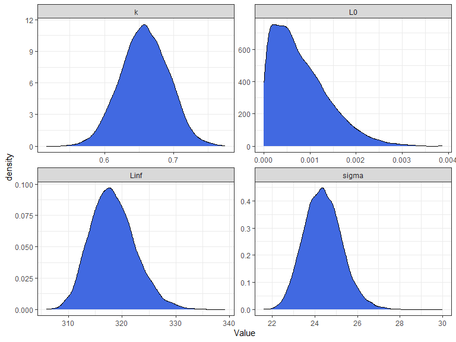

<!-- README.md is generated from README.Rmd. Please edit that file -->

# BayesGrowth

<!-- badges: start -->

[](https://zenodo.org/badge/latestdoi/223878432)
[](https://github.com/jonathansmart/BayesGrowth/actions/workflows/R-CMD-check.yaml)
<!-- badges: end -->

BayesGrowth combines length-at-age modelling for fisheries with MCMC
implemented using Stan and the
[rstan](https://mc-stan.org/users/interfaces/rstan) package. Growth
modelling using models such as the von Bertalanffy growth model involves
three parameters:
,
*k* and either

or
.
Two of these parameters:

and

have direct biological meaning as the size-at-birth and maximum length,
respectively. This package provides the tools to run an MCMC model with
these two parameters treated as size-at-birth and maximum length using a
rstan model with a No U-Turn Sampling (NUTS) algorithm. This MCMC model
is pre-specified and built into wrapper functions.

The user can therefore run an MCMC growth model using knowledge of
species length-at-birth and maximum size as priors.

## Installation

You can install the released version of BayesGrowth from
[Github](https://github.com/jonathansmart/BayesGrowth) using devtools.
There is a vignette that runs an example and demonstrates how to examine
diagnostic plots.

``` r
if (!require("devtools")) {
  install.packages("devtools")
}

devtools::install_github("jonathansmart/BayesGrowth", build_vignettes = TRUE)

browseVignettes("BayesGrowth")
```

Or alternatively you can install the [latest
release](https://github.com/jonathansmart/BayesGrowth/releases)
manually. This can be useful as when downloading from github you’ll
automatically build the package from the source. However, as the rstan
models contain compiled code, this can lead to build errors without
proper installs of devtools or Rtools.

If you need to install the package manually (skipping the compiling) you
can go to the latest release and download the package file
(‘BayesGrowth_ver.zip’). This can then be installed from Rstudio using
Packages -\> Install -\> Package Archive File (.zip, tar.gz).

## Usage

The main `BayesGrowth` function is `Estimate_MCMC_Growth` which is the
wrapper function around an rstan model. It requires a data input that
includes columns that can be identified “Age” and “Length”, the model
needs to be specified (several options are available) and the priors
must be specified. Priors include the max size with an error,
length-at-birth with an error and upper limits for *k* and
.
These latter two parameters have no informative priors and only require
sensible upper bounds. Many fish species (including this example) have a
size at birth of zero. Therefore, this can value can be used as a prior
along with a very small error to indicate high certainty of this prior.
The `L0.se` argument cannot be zero, but the model is specified to
truncate

at zero and keep growth positive.

``` r
library(BayesGrowth)

data("example_data")

## Biological info - lengths in mm
max_size <- 440
max_size_se <- 5
birth_size <- 0
birth_size_se <- 0.001 # an se cannot be zero

# Use the function to estimate the rstan model
fit <- Estimate_MCMC_Growth(data = example_data, 
                            Model = "VB" ,
                            iter = 5000,
                            Linf = max_size,
                            Linf.se = max_size_se,
                            L0 = birth_size,
                            sigma.max = 100,
                            L0.se = birth_size_se,
                            k.max = 1)
```

The function returns the rstan outputs which is an object of class
“stanfit”

``` r
fit
#> Inference for Stan model: VB_stan_model.
#> 4 chains, each with iter=5000; warmup=2500; thin=1; 
#> post-warmup draws per chain=2500, total post-warmup draws=10000.
#> 
#>           mean se_mean   sd     2.5%      25%      50%      75%    97.5% n_eff
#> Linf    317.86    0.09 4.13   310.52   314.98   317.58   320.40   326.58  2150
#> k         0.66    0.00 0.03     0.59     0.64     0.66     0.69     0.73  2274
#> L0        0.00    0.00 0.00     0.00     0.00     0.00     0.00     0.00  3991
#> sigma    24.30    0.02 0.87    22.73    23.68    24.25    24.87    26.13  2538
#> lp__  -3933.95    0.03 1.52 -3937.81 -3934.70 -3933.61 -3932.84 -3932.06  2305
#>       Rhat
#> Linf     1
#> k        1
#> L0       1
#> sigma    1
#> lp__     1
#> 
#> Samples were drawn using NUTS(diag_e) at Mon Nov 20 13:44:46 2023.
#> For each parameter, n_eff is a crude measure of effective sample size,
#> and Rhat is the potential scale reduction factor on split chains (at 
#> convergence, Rhat=1).
```

Therefore, all of the diagnostics from the rstan library can be used.
Some examples are the `pairs` and `extract` functions:

``` r
library(tidyverse)
library(rstan)

pairs(fit, pars = c("Linf", "k","L0", "sigma"))
#> Warning in par(usr): argument 1 does not name a graphical parameter

#> Warning in par(usr): argument 1 does not name a graphical parameter

#> Warning in par(usr): argument 1 does not name a graphical parameter

#> Warning in par(usr): argument 1 does not name a graphical parameter
```


``` r

list_of_draws <- extract(fit,c("Linf", "k","L0", "sigma")) %>% 
  as.data.frame() %>% 
  gather(Parameter, Value) %>% 
  filter(Parameter %in% c("Linf", "k","L0", "sigma"))


ggplot(list_of_draws, aes(Value))+
  geom_density(fill = "royalblue")+
  facet_wrap(~Parameter, scales = "free", ncol = 2)+
  theme_bw()
```



Additional `BayesGrowth` functions are available that help the user
manipulate the returned `Estimate_MCMC_Growth` object. The
`Calculate_MCMC_growth_curve` function will provide confidence intervals
around the growth curve based on MCMC parameter percentiles. This is
essentially a wrapper around the `tidybayes::mean_qi()` function which
means it can be passed straight into a ggplot with the
`tidybayes::geom_line_ribbon` function.

``` r

library(tidybayes)

# Return a growth curve with 50th and 95th percentiles
growth_curve <- Calculate_MCMC_growth_curve(fit, Model = "VB",
                                            max.age = max(example_data$Age), probs = c(.5,.95))


ggplot(growth_curve, aes(Age, LAA))+
  geom_point(data = example_data, aes(Age, Length), alpha = .3)+
  geom_lineribbon(aes( ymin = .lower, ymax = .upper, fill = factor(.width)), size = .8) +
  labs(y = "Total Length (mm)", x = "Age (yrs)")+
  scale_fill_brewer(palette="BuPu", direction=-1,name = "Credibility interval")+
  scale_y_continuous(expand = c(0,0))+
  scale_x_continuous(expand = c(0,0), breaks = seq(0,13,1))+
  theme_bw()+
  theme(text = element_text(size = 14),
        legend.position = c(0.8,0.2),
        legend.background = element_rect(colour = "black"))
```


This represents a much improved fit over a standard non-linear estimated
model, even if the length-at-birth were fixed at zero. Here the fit is
compared using an nls model fit using the [AquaticLifeHistory
package](https://github.com/jonathansmart/AquaticLifeHistory).


